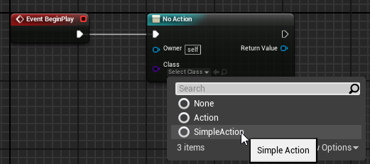
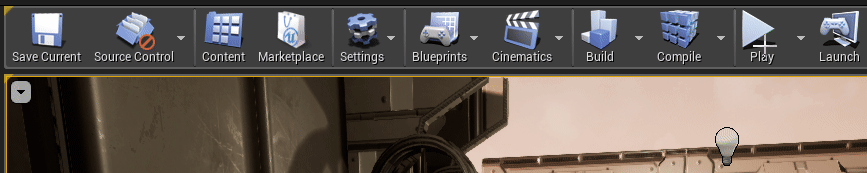

# Quick Start

Quick Start will show the basic steps to follow to setup the plugin and start using it at a base level.

## Setting Up the Project

We can start by creating an empty project ([How to create UE4 projects](https://docs.unrealengine.com/en-US/Engine/Basics/Projects/Browser)) or instead using your own. Then installing the plugin from marketplace or inside Plugins folder (See [Installation](installation.md)).

If everything went right, we should see the plugin enabled under *Edit->Plugins->Piperift*

Actions Extension doesn't require anything else to work. 🎊

## Creating The action

Lets start by creating a very simple action.

First we go to the **content browser, right click, Blueprint Class**

Then we **select Action class** (or any other child class of Action)

Then we **open the blueprint** we created and add the following functions on Activate. This will be called when the action starts its execution, then wait 1 second, and finish.

 Make sure your actions call **Succeed** or **Fail**. Otherwise the action will run until its owner is destroyed or the game closes. 

## Calling The action

Now that we have our action ready, we have to execute it. For that we will go to our level blueprint.

Then from our BeginPlay we **add the node "Action"**

Finally, we assign the action we created previously to the class pin

## The Result

After all the previous steps we will see that the message prints exactly 1 second after we hit play.

