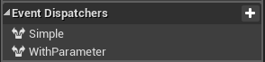
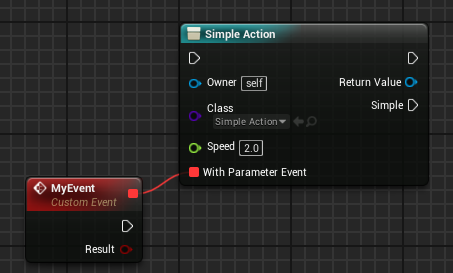

Exposing Delegates

**Actions can expose Event Dispatchers to action calls.**

- If the event dispatcher has any parameter, it will show up as an event pin
- If it has no parameters, an execution pin will show up

So as an example, if we have the following two events:

- **SimpleEvent** with no parameters

- **EventWithParameter** with a boolean

  

Our Action will look like this:

 If an event doesn't appear on an action node, **right click -> Refresh Node** to refresh it 

