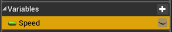
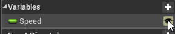

# Exposing Variables

Most of the times, when we have an action, we want to feed it with variables to customize its behavior, and as you will see, it's very easy to do so.

First open your Action blueprint and add a new variable of any type

Mark the variable as Editable

Finally, check "**Expose on Spawn**" as true

This variable will now show up on all action nodes.

 If a variable doesn't appear on an action node, **right click -> Refresh Node** to refresh it 