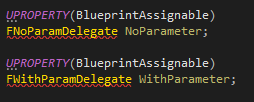

Exposing Delegates

**Actions can expose Multicast delegates to action calls.**

- If the delegate has any parameter, it will show up as an event pin
- If it has no parameters, an execution pin will show up

So as an example, if we have the following two events:

- **NoParameter** with no parameters
- **WithParameter** with a boolean

We first have to declare our delegates

Then we add their variables as BlueprintAssignable, and that's it.

*Ignore those errors, it's just Intellisense doing its usual magic. Everything is fine, I promise*

